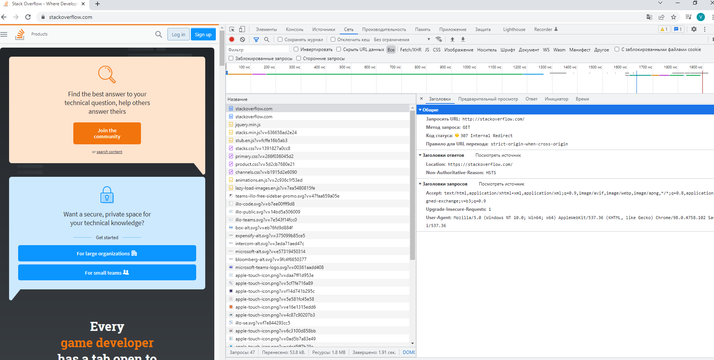
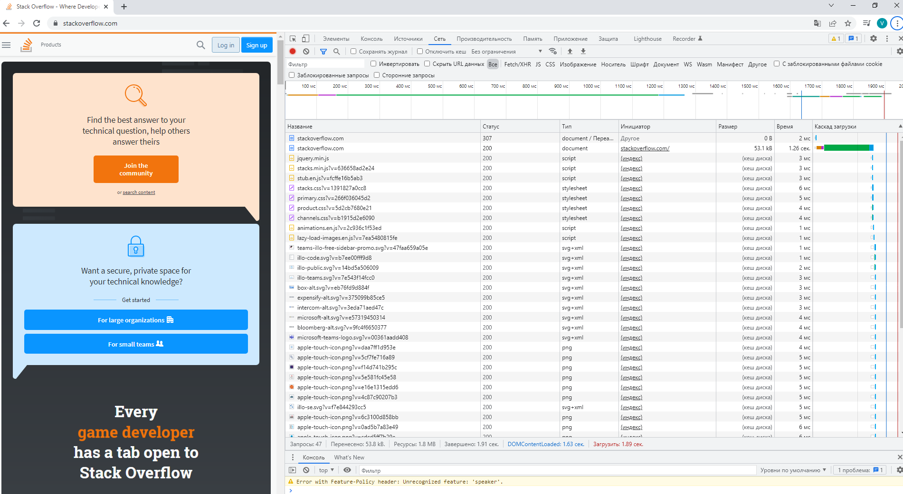
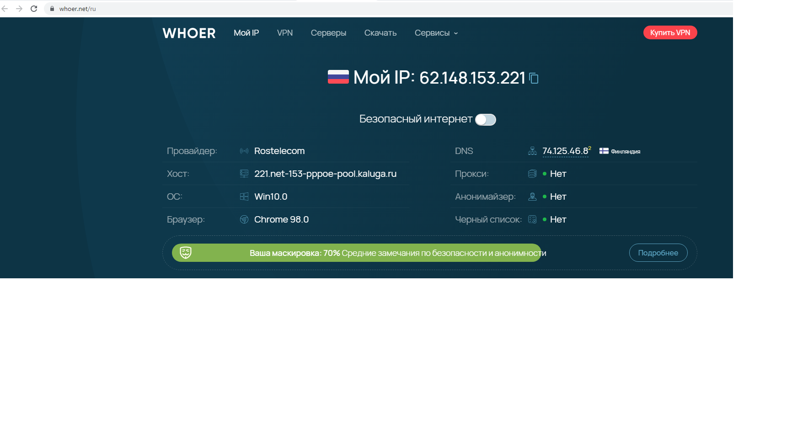

#_Домашнее задание занятию "Домашнее задание к занятию "3.6. Компьютерные сети, лекция 1"_ #
##Выполнил  - Каплин Владимир ##


1. Работа c HTTP через телнет.
Подключитесь утилитой телнет к сайту stackoverflow.com telnet stackoverflow.com 80
отправьте HTTP запрос
```
GET /questions HTTP/1.0
HOST: stackoverflow.com
[press enter]
[press enter]
```
В ответе укажите полученный HTTP код, что он означает?

Решение: Получен ответ 301 Moved Permanently, который обозначает, что произошел редирект на https адрес
https://stackoverflow.com/questions
```
vagrant@vagrant:~$ telnet stackoverflow.com 80
Trying 151.101.65.69...
Connected to stackoverflow.com.
Escape character is '^]'.
GET /questions HTTP/1.0
HOST: stackoverflow.com

HTTP/1.1 301 Moved Permanently
cache-control: no-cache, no-store, must-revalidate
location: https://stackoverflow.com/questions
x-request-guid: 56840993-dca9-4aa1-9350-88ab5641d5f4
feature-policy: microphone 'none'; speaker 'none'
content-security-policy: upgrade-insecure-requests; frame-ancestors 'self' https://stackexchange.com
Accept-Ranges: bytes
Date: Fri, 18 Feb 2022 21:30:37 GMT
Via: 1.1 varnish
Connection: close
X-Served-By: cache-ams21027-AMS
X-Cache: MISS
X-Cache-Hits: 0
X-Timer: S1645219838.500402,VS0,VE75
Vary: Fastly-SSL
X-DNS-Prefetch-Control: off
Set-Cookie: prov=8dbf8441-ac85-8987-5dc6-f5b37068f838; domain=.stackoverflow.com; expires=Fri, 01-Jan-2055 00:00:00 GMT; path=/; HttpOnly

Connection closed by foreign host.
```

Wikipedia

```
Код состояния HTTP 301 или Moved Permanently (с англ. — «Перемещено навсегда») — стандартный код ответа HTTP, 
получаемый в ответ от сервера в ситуации, когда запрошенный ресурс был на постоянной основе перемещён в новое месторасположение,
и указывающий на то, что текущие ссылки, использующие данный URL, должны быть обновлены. 
Адрес нового месторасположения ресурса указывается в поле Location получаемого в ответ заголовка пакета протокола HTTP. 
В RFC 2616 указано, что:
-если у клиента есть возможность редактирования ссылки, то ему следует обновить все ссылки на запрашиваемый URL;
запрос кэшируется[1];
-в случае, если метод запроса был не HEAD, то содержимое должно включать в себя небольшое гипертекстовое примечание с гиперссылкой на новый URL;
если код состояния 301 был получен в ответ на запрос любого другого типа, кроме GET или HEAD, то клиент должен спросить пользователя о перенаправлении.
```

2. Повторите задание 1 в браузере, используя консоль разработчика F12.
откройте вкладку Network
отправьте запрос http://stackoverflow.com
найдите первый ответ HTTP сервера, откройте вкладку Headers
укажите в ответе полученный HTTP код.
проверьте время загрузки страницы, какой запрос обрабатывался дольше всего?
приложите скриншот консоли браузера в ответ.


Решение: При использование браузера Chrome возвращается ответ 307 и происходит перенаправление на https://stackoverflow.com/


Загрузка страницы составила 1,93 секудны, самая длительная загрузка ответ по адресу https://stackoverflow.com/, вторая строка.


3. Какой IP адрес у вас в интернете?

Решение:


или 
```
vagrant@vagrant:~$ wget -qO - ifconfig.co
62.148.153.221
```
4. Какому провайдеру принадлежит ваш IP адрес? Какой автономной системе AS? Воспользуйтесь утилитой whois

Решение: IP 62.148.153.221 принадлежит провайдеру Kaluga Elecs NOC, номера AS равен 


```
vagrant@vagrant:~$ whois 62.148.153.221
% This is the RIPE Database query service.
% The objects are in RPSL format.
%
% The RIPE Database is subject to Terms and Conditions.
% See http://www.ripe.net/db/support/db-terms-conditions.pdf

% Note: this output has been filtered.
%       To receive output for a database update, use the "-B" flag.

% Information related to '62.148.153.0 - 62.148.153.255'

% Abuse contact for '62.148.153.0 - 62.148.153.255' is 'abuse@rt.ru'

inetnum:        62.148.153.0 - 62.148.153.255
netname:        MACROREGIONAL_CENTER
descr:          OJSC Rostelecom, Kaluga branch
descr:          ex-netname:INDIVIDUALNIY PREDPRINIMATEL SEMKA
country:        RU
admin-c:        KLG6-RIPE
tech-c:         KLG6-RIPE
status:         ASSIGNED PA
mnt-by:         KLGELECS-MNT
mnt-lower:      KLGELECS-MNT
created:        2008-04-28T12:46:05Z
last-modified:  2012-09-25T04:36:52Z
source:         RIPE

role:           Kaluga Elecs NOC
address:        OJSC Rostelecom
address:        38, Teatralnaya str.
address:        248600  Kaluga
address:        Russia
phone:          +7 4842 563932
admin-c:        ALS5-RIPE
tech-c:         GVAN1-RIPE
tech-c:         ALEC2-RIPE
tech-c:         ADEM2-RIPE
abuse-mailbox:  abuse@kaluga.ru
remarks:        ---------------------------------------------------------
remarks:        CIT monitoring group is available 24 x 7
remarks:        ---------------------------------------------------------
remarks:        SPAM and Network security issues:    abuse@kaluga.ru
remarks:        Network administration:              noc@kaluga.ru
remarks:        Network monitoring:                  monitoring@kaluga.ru
remarks:        DNS administration:                  dnsmaster@kaluga.ru
remarks:        Web hosting:                         hosting@kaluga.ru
remarks:        Techsupport:                         support@kaluga.ru
remarks:        ---------------------------------------------------------
nic-hdl:        KLG6-RIPE
mnt-by:         KLGELECS-MNT
created:        2002-02-07T13:35:10Z
last-modified:  2013-11-14T07:43:16Z
source:         RIPE # Filtered

% Information related to '62.148.144.0/20AS15468'

route:          62.148.144.0/20
descr:          RU-KLGELECS Block 2
mnt-routes:     ROSTELECOM-MNT
descr:          JSC Rostelecomelecom Kaluga branch
origin:         AS15468
mnt-by:         KLGELECS-MNT
created:        2011-06-23T04:31:05Z
last-modified:  2018-10-19T10:58:00Z
source:         RIPE

% This query was served by the RIPE Database Query Service version 1.102.2 (HEREFORD)
```

Для определения номера AS можно подключиться к хосту  whois.radb.net. Номер AS равен AS15468.

```
vagrant@vagrant:~$ whois -h whois.radb.net 62.148.153.221
route:      62.148.128.0/19
descr:      Proxy-registered route object
origin:     AS15468
remarks:    This route object is for a BtN customer route
remarks:    which is being exported under this origin AS.
remarks:
remarks:    This route object was created because no existing
remarks:    route object with the same origin was found, and
remarks:    since some BtN peers filter based on these objects
remarks:    this route may be rejected if this object is not created.
remarks:
remarks:    Please contact peering@cais.net if you have any
remarks:    questions regarding this object.
mnt-by:     MAINT-AS3491
changed:    sajwani@pccwbtn.com 20031118
source:     RADB

route:          62.148.144.0/20
descr:          RU-KLGELECS Block 2
mnt-routes:     ROSTELECOM-MNT
descr:          JSC Rostelecomelecom Kaluga branch
origin:         AS15468
mnt-by:         KLGELECS-MNT
created:        2011-06-23T04:31:05Z
last-modified:  2018-10-19T10:58:00Z
source:         RIPE
remarks:        ****************************
remarks:        * THIS OBJECT IS MODIFIED
remarks:        * Please note that all data that is generally regarded as personal
remarks:        * data has been removed from this object.
remarks:        * To view the original object, please query the RIPE Database at:
remarks:        * http://www.ripe.net/whois
remarks:        ****************************
```
5. Через какие сети проходит пакет, отправленный с вашего компьютера на адрес 8.8.8.8? 
Через какие AS? Воспользуйтесь утилитой traceroute

Решение:

С помощью утилиты traceroute  удалось установить сети через которые проходит пакет на адрес 8.8.8.8
```
vagrant@vagrant:~$ traceroute -IAn 8.8.8.8
traceroute to 8.8.8.8 (8.8.8.8), 30 hops max, 60 byte packets
 1  10.0.2.2 [*]  0.625 ms  0.455 ms  0.315 ms
 2  192.168.1.1 [*]  7.249 ms  7.120 ms  7.007 ms
 3  * * *
 4  * 10.55.2.1 [*]  10.920 ms  12.343 ms
 5  62.148.153.217 [AS15468]  13.952 ms  14.460 ms  15.196 ms
 6  188.254.36.60 [AS12389]  33.206 ms  5.809 ms  5.640 ms
 7  87.226.181.85 [AS12389]  13.854 ms  14.699 ms  14.543 ms
 8  72.14.209.89 [AS15169]  16.331 ms  16.233 ms  16.139 ms
 9  108.170.250.33 [AS15169]  16.909 ms  17.618 ms  17.915 ms
10  108.170.250.51 [AS15169]  15.387 ms  15.227 ms  15.669 ms
11  * * *
12  172.253.66.110 [AS15169]  30.467 ms  30.305 ms  30.815 ms
13  209.85.254.135 [AS15169]  30.674 ms  30.586 ms  30.512 ms
14  * * *
15  * * *
16  * * *
17  * * *
18  * * *
19  * * *
20  * * *
21  * * *
22  * * *
23  8.8.8.8 [AS15169]  32.907 ms  28.553 ms *
```
Укажем также автономные сети:
```
vagrant@vagrant:~$ traceroute -IAn 8.8.8.8 | grep "A"
 5  62.148.153.217 [AS15468]  10.751 ms  12.375 ms  12.311 ms
 6  188.254.36.60 [AS12389]  33.156 ms  6.198 ms  6.008 ms
 7  87.226.181.85 [AS12389]  14.141 ms  15.969 ms  15.796 ms
 8  72.14.209.89 [AS15169]  16.472 ms  16.909 ms  16.736 ms
 9  108.170.250.33 [AS15169]  17.523 ms  17.380 ms  17.750 ms
11  216.239.51.32 [AS15169]  34.053 ms  36.405 ms *
12  172.253.66.110 [AS15169]  36.571 ms  36.418 ms  31.992 ms
13  209.85.254.135 [AS15169]  32.460 ms  31.553 ms  31.399 ms
23  * 8.8.8.8 [AS15169]  29.638 ms *
```

Информацию о маршруте также удалось получить с помощью утилиты tracert, вероятно,она отрабатывает за счет использования 
другого протокола и пакеты для данного протокола проходят.
```
PS C:\Users\kapli> tracert -d 8.8.8.8

Трассировка маршрута к 8.8.8.8 с максимальным числом прыжков 30

  1     *        3 ms     2 ms  192.168.1.1
  2    61 ms    10 ms     7 ms  10.0.0.1
  3     6 ms     2 ms     2 ms  10.55.2.1
  4     9 ms     5 ms     5 ms  62.148.153.217
  5     8 ms     6 ms     6 ms  188.254.36.60
  6    13 ms    13 ms    13 ms  87.226.181.85
  7    15 ms    79 ms    14 ms  72.14.209.89
  8    17 ms    16 ms    16 ms  108.170.250.33
  9    16 ms    14 ms    14 ms  108.170.250.51
 10     *       56 ms     *     216.239.51.32
 11   109 ms    66 ms    29 ms  172.253.66.110
 12    33 ms    29 ms    30 ms  209.85.254.135
 13     *        *        *     Превышен интервал ожидания для запроса.
 14     *        *        *     Превышен интервал ожидания для запроса.
 15     *        *        *     Превышен интервал ожидания для запроса.
 16     *        *        *     Превышен интервал ожидания для запроса.
 17     *        *        *     Превышен интервал ожидания для запроса.
 18     *        *        *     Превышен интервал ожидания для запроса.
 19     *        *        *     Превышен интервал ожидания для запроса.
 20     *        *        *     Превышен интервал ожидания для запроса.
 21     *        *        *     Превышен интервал ожидания для запроса.
 22     *       33 ms    28 ms  8.8.8.8.
```


6. Повторите задание 5 в утилите mtr. На каком участке наибольшая задержка - delay?

Решение: наибольшое время отклика приходится на автономную сеть AS15169, IP 209.85.254.135


```
agrant (10.0.2.15)                                                                                                                                                                     2022-02-23T10:00:58+0000
Keys:  Help   Display mode   Restart statistics   Order of fields   quit
                                                                                                                                                                        Packets               Pings
 Host                                                                                                                                                                 Loss%   Snt   Last   Avg  Best  Wrst StDev
 1. AS???    10.0.2.2                                                                                                                                                  0.0%    89    1.6   1.5   0.8   4.8   0.6
 2. AS???    192.168.1.1                                                                                                                                              23.6%    89    5.2   6.0   2.4  58.9  10.4
 3. AS???    10.0.0.1                                                                                                                                                  8.0%    89   11.6  12.7   4.2  72.9  12.2
 4. AS???    10.55.2.1                                                                                                                                                 9.0%    89    9.4   9.1   3.9  53.1   8.2
 5. AS15468  62.148.153.217                                                                                                                                            6.7%    89    7.5  14.8   6.9  72.2  12.8
 6. AS12389  188.254.36.60                                                                                                                                             0.0%    89    7.1  11.5   6.7  49.2   6.7
 7. AS12389  87.226.181.85                                                                                                                                            10.1%    89   19.3  28.2  14.9 582.8  63.6
 8. AS15169  72.14.209.89                                                                                                                                              0.0%    89   20.3  22.6  16.2 107.0  14.8
 9. AS15169  108.170.250.33                                                                                                                                            1.1%    89   19.9  23.8  16.9 101.1  13.6
10. AS15169  108.170.250.51                                                                                                                                           28.1%    89   18.7  23.0  16.3  70.3  10.6
11. AS15169  216.239.51.32                                                                                                                                            50.6%    89   32.3  37.0  30.6  70.0   8.2
12. AS15169  172.253.66.110                                                                                                                                            0.0%    89   31.9  35.2  30.2  88.0   9.2
13. AS15169  209.85.254.135                                                                                                                                            0.0%    89   54.6  37.4  30.7  94.5  11.5
14. (waiting for reply)
15. (waiting for reply)
16. (waiting for reply)
17. (waiting for reply)
18. (waiting for reply)
19. (waiting for reply)
20. (waiting for reply)
21. (waiting for reply)
22. (waiting for reply)
23. AS15169  8.8.8.8                                                                                                                                                  22.7%    88   36.5  34.8  28.6  71.4   7.9

```

7. Какие DNS сервера отвечают за доменное имя dns.google? Какие A записи? воспользуйтесь утилитой dig

Решение:
За имя dns.google отвечают DNS сервера ns1.zdns.google  - ns4.zdns.google
```
vagrant@vagrant:~$ dig dns.google NS

; <<>> DiG 9.16.1-Ubuntu <<>> dns.google NS
;; global options: +cmd
;; Got answer:
;; ->>HEADER<<- opcode: QUERY, status: NOERROR, id: 15553
;; flags: qr rd ra; QUERY: 1, ANSWER: 4, AUTHORITY: 0, ADDITIONAL: 1

;; OPT PSEUDOSECTION:
; EDNS: version: 0, flags:; udp: 65494
;; QUESTION SECTION:
;dns.google.                    IN      NS

;; ANSWER SECTION:
dns.google.             6798    IN      NS      ns2.zdns.google.
dns.google.             6798    IN      NS      ns4.zdns.google.
dns.google.             6798    IN      NS      ns1.zdns.google.
dns.google.             6798    IN      NS      ns3.zdns.google.
```

Записи типа A 

dns.google.             216     IN      A       8.8.4.4
dns.google.             216     IN      A       8.8.8.8

```
vagrant@vagrant:~$ dig +trace dns.google

; <<>> DiG 9.16.1-Ubuntu <<>> +trace dns.google
;; global options: +cmd
.                       6822    IN      NS      i.root-servers.net.
.                       6822    IN      NS      c.root-servers.net.
.                       6822    IN      NS      b.root-servers.net.
.                       6822    IN      NS      l.root-servers.net.
.                       6822    IN      NS      a.root-servers.net.
.                       6822    IN      NS      h.root-servers.net.
.                       6822    IN      NS      m.root-servers.net.
.                       6822    IN      NS      k.root-servers.net.
.                       6822    IN      NS      e.root-servers.net.
.                       6822    IN      NS      f.root-servers.net.
.                       6822    IN      NS      g.root-servers.net.
.                       6822    IN      NS      d.root-servers.net.
.                       6822    IN      NS      j.root-servers.net.
;; Received 262 bytes from 127.0.0.53#53(127.0.0.53) in 3 ms

dns.google.             216     IN      A       8.8.4.4
dns.google.             216     IN      A       8.8.8.8
.                       13451   IN      NS      l.root-servers.net.
.                       13451   IN      NS      b.root-servers.net.
.                       13451   IN      NS      c.root-servers.net.
.                       13451   IN      NS      i.root-servers.net.
.                       13451   IN      NS      j.root-servers.net.
.                       13451   IN      NS      d.root-servers.net.
.                       13451   IN      NS      g.root-servers.net.
.                       13451   IN      NS      f.root-servers.net.
.                       13451   IN      NS      e.root-servers.net.
.                       13451   IN      NS      k.root-servers.net.
.                       13451   IN      NS      m.root-servers.net.
.                       13451   IN      NS      h.root-servers.net.
.                       13451   IN      NS      a.root-servers.net.
;; Received 479 bytes from 192.58.128.30#53(j.root-servers.net) in 7 ms
```

8. Проверьте PTR записи для IP адресов из задания 7. Какое доменное имя привязано к IP? воспользуйтесь утилитой dig

Решение:

Для IP 8.8.4.4
```
vagrant@vagrant:~$ dig -x 8.8.4.4

; <<>> DiG 9.16.1-Ubuntu <<>> -x 8.8.4.4
;; global options: +cmd
;; Got answer:
;; ->>HEADER<<- opcode: QUERY, status: NOERROR, id: 30106
;; flags: qr rd ra; QUERY: 1, ANSWER: 1, AUTHORITY: 0, ADDITIONAL: 1

;; OPT PSEUDOSECTION:
; EDNS: version: 0, flags:; udp: 65494
;; QUESTION SECTION:
;4.4.8.8.in-addr.arpa.          IN      PTR

;; ANSWER SECTION:
4.4.8.8.in-addr.arpa.   16511   IN      PTR     dns.google.

;; Query time: 47 msec
;; SERVER: 127.0.0.53#53(127.0.0.53)
;; WHEN: Wed Feb 23 16:21:10 UTC 2022
;; MSG SIZE  rcvd: 73
```
Для IP 8.8.8.8
```
vagrant@vagrant:~$ dig -x 8.8.8.8

; <<>> DiG 9.16.1-Ubuntu <<>> -x 8.8.8.8
;; global options: +cmd
;; Got answer:
;; ->>HEADER<<- opcode: QUERY, status: NOERROR, id: 64990
;; flags: qr rd ra; QUERY: 1, ANSWER: 1, AUTHORITY: 0, ADDITIONAL: 1

;; OPT PSEUDOSECTION:
; EDNS: version: 0, flags:; udp: 65494
;; QUESTION SECTION:
;8.8.8.8.in-addr.arpa.          IN      PTR

;; ANSWER SECTION:
8.8.8.8.in-addr.arpa.   20658   IN      PTR     dns.google.

;; Query time: 39 msec
;; SERVER: 127.0.0.53#53(127.0.0.53)
;; WHEN: Wed Feb 23 16:22:43 UTC 2022
;; MSG SIZE  rcvd: 73
```